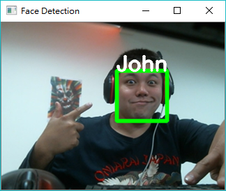

# 108facedetect
<h2>人臉辨識練習小程式</h2>
版本：V0.1 
 
用途：可以作為門禁、打卡功能快速開發 
 
縮圖參考： 
  
 
相依程式： 
　　python 3.6.4 x86 (32bit) 
　　pip install scipy 
　　pip install dlib 
　　pip install numpy 
　　pip install opencv-python 
　　pip install scikit-image 
　　pip install matplotlib 
　　pip install imutils 
　　Webcam 一組 
 
第三方下載： 
　　68特徵：http://dlib.net/files/shape_predictor_68_face_landmarks.dat.bz2 
　　人臉模型：http://dlib.net/files/dlib_face_recognition_resnet_model_v1.dat.bz2 
 
使用方式： 
　　1、先收集所有屁孩的大頭照或生活照，正面、臉清晰照片，檔名為屁孩的名字，存至 rec/pic，如 rec/pic/john.jpg，同一個人越多張越好，如 rec/pic/john#1.jpg rec/pic/john#2.jpg 
　　2、將照片作出特徵檔，執行 pic_to_numpy.py：python pic_to_numpy.py 
　　3、啟動 Webcam：python cam.py 
 
程式說明： 
　　rec/pic 目錄，放人臉，一個人一張，如 john.jpg，同一個jpg只能有一個人，同一個人請多檔，如john#1.jpg john#2.jpg 
　　rec/numpy 目錄，透過 pic_to_numpy.py 執行後，會把 rec/pic 目錄下所有人作出特徵檔 rec/numpy/人名.npy 檔案 
　　pic_to_numpy.py 把 rec/pic 目錄下的所有照片，算出特徵檔，然後會產生到 rec/numpy 下，可以加快辨識速度。 
　　cam.py 啟動Webcam，人臉會被自動框出，每30個影格判斷一次該影格的人是誰。 
 
參考資料： 
　　1、https://tpu.thinkpower.com.tw/tpu/articleDetails/950 　　